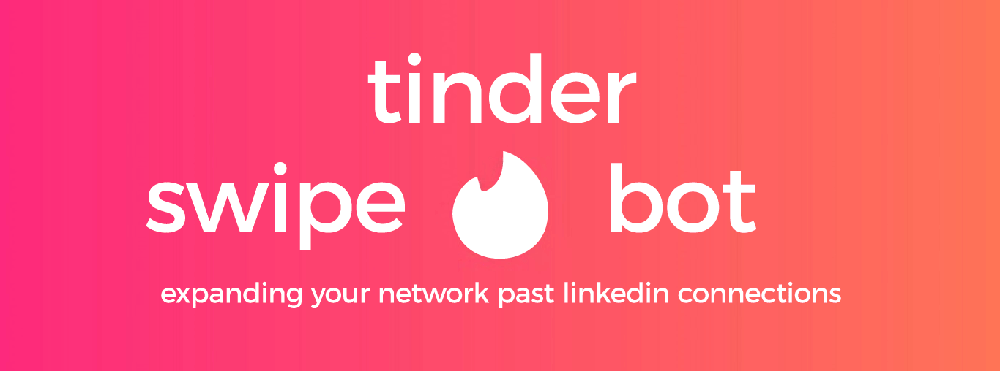

# Swipe Bot
**Using dating apps to find a job**
 Aaron Lee
 
[Linkedin](http://www.linkedin.com/in/aaronhjlee)  |  [Github](https://github.com/aaronhjlee)   |   aaronhjlee1@gmail.com

## Table of Contents

* [Motivation](#motivation)
  * [Question](#question)
* [Set Up](#set-up)
* [Results](#results)
* [Future Analysis](#future-analysis)
* [References](#references)
* [Contact](#contact-information)

## Motivation

In short, I was fed up with how the job application process was going. I was a former educator in the inner-city of San Francisco teaching primary grades for the past 2 years and was looking to make a switch into tech. I always had a passion for data and analytics which naturally led me to do a bootcamp in Data Science with Galvanize. Why a bootcamp? I thought the skills I needed to land a job in data science / data analytics could be learned at the bootcamp which would be sufficient as base point to get my *first job* in tech. Yes and no. With over 400+ job applications sent out, ~30 of those being referrals, 75+ rejections, and ~17 callbacks, I decided to embark on a project that would *expand my job search* beyond my normal friend circle. 

I have heard of people using Linkedin to randomly message users to solicit a date, most definitely creepy and unprofessional to say the least. In the spirit of going counter culture to something that isn't really Linkedin culture, I decided to use python to build a bot to make connections on a dating platform to increase my circle of possibility. 

### Question

Could I get ANY referrals from dating platforms?
Would this be worth my time?

## Set Up

1. Install Chromedriver
  - https://chromedriver.storage.googleapis.com/index.html?path=80.0.3987.106/
  - Download, unzip, and put Chromedriver in a destination where you know the file path. For me it was `/Users/AaronLee/Documents/GitHub/chromedriver` (important later)
2. Install Selenium
  - Open up your terminal
  - Type the following: `pip install selenium`
3. Create credentials to login to Tinder
  - Open up a new .py file in code editor
  - 
  - save as `login_info.py`
4. Fork the repo and open up `tinder_bot.py` in a code editor such as VSC, Sublime, etc. and change the following:
  - In line 3, in the parenthesis of `sys.path.append('/Users/AaronLee/Documents/GitHub/creds')`, change to the file path with your login_info
  - In line 9, in the parenthesis of `self.driver = webdriver.Chrome('/Users/AaronLee/Documents/GitHub/chromedriver')`, change the file path to of Chromedriver from step 1
5. Run the script
  - Runs the .py file in an interactive environment, allowing you to call on functions
    * `python -i tinder_bot.py`
  - After login, this automatically swipes right on every individual
    * `bot.auto_swipe()`
    * specify how many right swipes you want during this session
    * 0 is for no messaging after the swipes finish
    * 1 is for messaging the matches afterwards
  - To only messages your matches
    * `bot.auto_message()`
  - To quit
    * control + c
    * `exit()`

## Results

Over the course of my job search, in 3.5 months, I've applied to:
  * ~400 companies
  * 81 rejections
  * 18 call-backs
  * 5 onsites
  * 3 offers

Soley from Tinder, here are the numbers from 2.5 weeks:
  * ~5000 right swipes
  * 350+ matches
  * 7 job referrals
  * 0 dates

## Future Analysis

Moving forward, you could filter for the text, age, description, distance, etc. in order to optimize the people you match with. For example, if you have collected enough data on the potential swipes and matches, you would be able to get a picture of a certain type of person who is more likely to match with you. Additionally, you could run each image of the individuals through a Convolutional Neural Network (CNN) in order to swipe right only on individuals who are deemed 'attractive' by the machine. 

## References

* https://www.youtube.com/watch?v=lvFAuUcowT4&t=3s

## Contact Information
Aaron Lee is a Customer Solutions Engineer / Data Scientist with a background in education and portrait/landscape photography. His interests other than data science include music, photography, backpacking, basketball, and running.

* Linkedin: [in/aaronhjlee](https://www.linkedin.com/in/aaronhjlee/)
* Github: [/aaronhjlee](https://github.com/Aaronhjlee)
* Email: [aaronhjlee1@gmail.com](aaronhjlee1@gmail.com)

Copyright © 2020 Aaron Lee